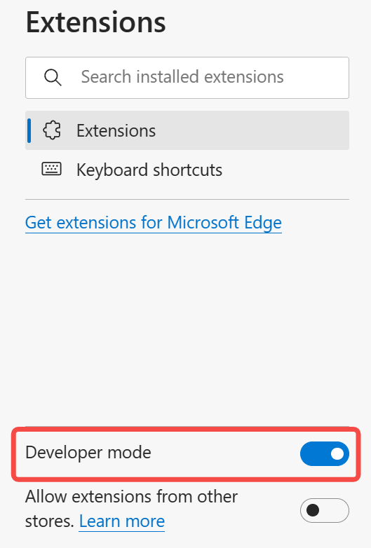
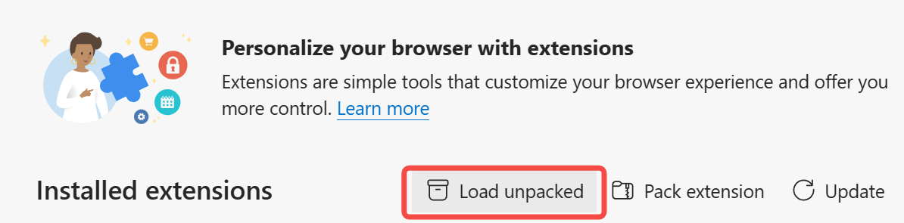

# 哈工大（深圳）课程回放平台助手

>   这个插件只是**个人在用**，很**不规范**

## 应用场景

[哈工大（深圳）课程回放平台](http://219.223.238.14:88/ve/Timeout.jsp)的视频播放功能并不是很友好，虽然提供暂停、倍速、全屏、退出全屏等操作，但**用起来极其不方便**。

插件将**常用的视频功能**绑定到较为方便的**键盘快捷键**上。

## 基本用法

### 导入

1.   `git clone` 或者直接下载本仓库文件夹到本地

2.   进入浏览器插件界面，打开开发者模式

     >   以 Edge 浏览器为例：
     >
     >    

3.   将本仓库文件夹直接加载到**浏览器插件**中

     >   以 Edge 浏览器为例：
     >
     >    

4.   打开插件，允许其运行

     >   Edge 会定期弹窗询问是否允许这类“不规范”的插件运行，选择”允许“就好

### 快捷键功能

>   本插件只会在**课程回放平台的视频播放页面**运行，不影响其他页面

-   全屏与退出全屏：
    -   全屏：`F`
    -   退出全屏：`Esc`
-   暂停与进退：
    -   暂停：`Space`
    -   取消暂停：`Space`
    -   前进：`->`
    -   后退：`<-`
-   倍速：
    -   1.0：`H`
    -   1.25：`J`
    -   1.5：`K`
    -   2.0：`L`

### 绕过“门槛”

弹出对话框时，点击“确认”后即可正常跳转
